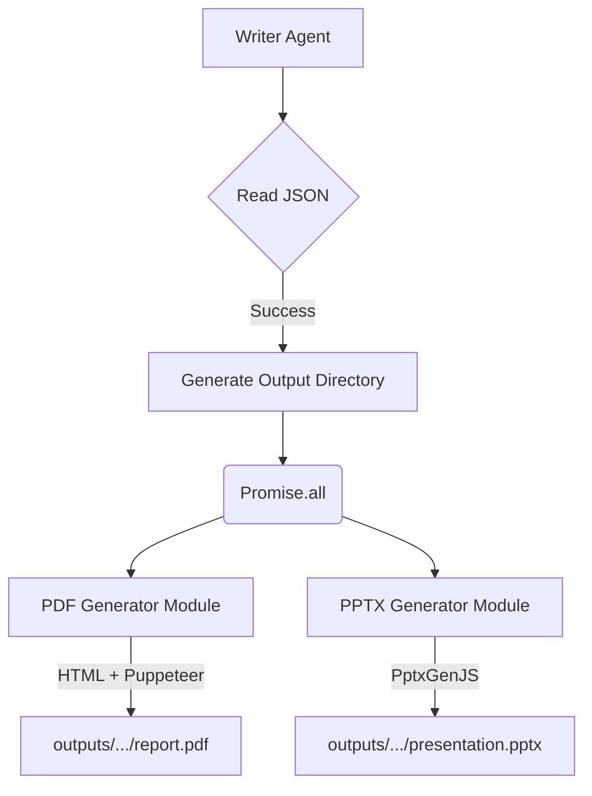

# Phase 2: Core Reporting Engine - Research

**Researched:** 2025-02-12
**Domain:** Document Generation (PDF/PPTX) and Agent Structure
**Confidence:** HIGH

## Summary

This phase establishes the final stage of the Araştır pipeline: taking structured JSON data from previous agents and transforming it into presentation-ready PDF and PPTX formats. The goal is to implement `REPORT-01` (PDF via Puppeteer), `REPORT-02` (PPTX via `pptxgenjs`), and `AGENT-01` (Writer Agent orchestrator).

Our research confirms that `puppeteer` and `pptxgenjs` are the industry standards for Node.js-based document generation. The `writer-agent` will serve as the orchestrator, reading JSON, formatting it, and invoking the document generators concurrently. 

**Primary recommendation:** Build the document generation as pure Node.js utilities invoked by the CLI-based `writer-agent`. If PDF generation is ever moved to a Vercel Next.js API Route, a migration from `puppeteer` to `puppeteer-core` + `@sparticuz/chromium` will be mandatory due to Vercel's 50MB function limit.

## Architectural Responsibility Map

| Capability | Primary Tier | Secondary Tier | Rationale |
|------------|-------------|----------------|-----------|
| Data Orchestration | CLI / Agent Runner | — | The `writer-agent` orchestrates the flow and reads the JSON file. |
| PDF Generation | Node.js | — | Puppeteer requires a Node environment to launch headless Chromium. Cannot run in browser/Edge. |
| PPTX Generation | Node.js | Browser / Client | `pptxgenjs` can run in both, but generating alongside PDF requires it to be a Node backend task. |
| Formatting & Styling | Node.js | — | HTML templating and slide layouts should be encapsulated in generator modules. |

## Standard Stack

### Core
| Library | Version | Purpose | Why Standard |
|---------|---------|---------|--------------|
| `puppeteer` | 22.15.0 | PDF Generation | Native Chromium PDF engine. Best possible rendering fidelity for HTML/CSS to PDF. |
| `pptxgenjs` | 3.12.0 | PPTX Generation | Most robust JavaScript library for creating native `.pptx` files with chart support. |

### Supporting
| Library | Version | Purpose | When to Use |
|---------|---------|---------|-------------|
| `fs` / `path` | built-in | File management | For reading agent JSON outputs and saving PDF/PPTX to the `outputs/` folder. |

### Alternatives Considered
| Instead of | Could Use | Tradeoff |
|------------|-----------|----------|
| `puppeteer` | `react-pdf` | Much faster, no Chromium dependency, but requires building layouts with React components instead of standard HTML/CSS. |
| `puppeteer` | `puppeteer-core` + `@sparticuz/chromium` | Required if deploying PDF generation to Vercel serverless. Exceeds standard local development complexity. |

## Architecture Patterns

### System Architecture Diagram



### Recommended Project Structure
```
src/
├── agents/
│   └── writer-agent.ts      # Orchestrates PDF & PPTX generation
├── lib/
│   ├── pdf/
│   │   └── generator.ts     # Puppeteer HTML-to-PDF logic
│   └── pptx/
│       └── generator.ts     # PptxGenJS slide generation logic
└── types/
    └── research.ts          # Shared TypeScript interfaces (e.g., ReportData)
```

### Pattern 1: Concurrent Generation
**What:** The Writer Agent should invoke both PDF and PPTX generators simultaneously.
**When to use:** Always, to minimize report generation time.
**Example:**
```typescript
await Promise.all([
  generatePdfReport(reportData, pdfOutputPath),
  generatePptxReport(reportData, pptxOutputPath)
]);
```

### Pattern 2: Headless HTML-to-PDF
**What:** Using `page.setContent()` with a raw HTML string to generate the PDF instead of navigating to a live URL.
**When to use:** When rendering offline/static data without a running web server.
**Example:**
```typescript
// Source: Puppeteer Documentation
const browser = await puppeteer.launch({ headless: true });
const page = await browser.newPage();
await page.setContent(htmlContent, { waitUntil: 'networkidle0' });
await page.pdf({ path: outputPath, format: 'A4', printBackground: true });
await browser.close();
```

### Anti-Patterns to Avoid
- **Navigation for static data:** Do not use `page.goto('file://...')` or stand up an Express server just to render the PDF. Use `page.setContent()`.
- **Synchronous Generation:** Avoid `await generatePdf(); await generatePptx();`. Run them in parallel using `Promise.all`.
- **Leaving Browser Open:** Always wrap browser operations in a `try...finally` block ensuring `await browser.close()` is called, otherwise orphaned Chromium processes will leak memory.

## Don't Hand-Roll

| Problem | Don't Build | Use Instead | Why |
|---------|-------------|-------------|-----|
| PPTX Structure | Raw XML `.pptx` zipping | `pptxgenjs` | Generating valid OpenXML is incredibly complex; `pptxgenjs` handles layouts, charts, and slide masters perfectly. |
| HTML to PDF | Custom Canvas renderers | `puppeteer` | Native browser print engines are the only reliable way to handle pagination, margins, and CSS print media. |

## Common Pitfalls

### Pitfall 1: Vercel Bundle Limit (50MB) with Puppeteer
**What goes wrong:** If you attempt to deploy the Next.js app to Vercel and include the standard `puppeteer` package in a Route Handler, the build will fail or timeout due to Chromium's ~300MB size.
**Why it happens:** Serverless functions have strict size limits.
**How to avoid:** Keep `puppeteer` generation restricted to local CLI agent execution. If Vercel API routing is needed in the future, migrate to `puppeteer-core` and `@sparticuz/chromium`.

### Pitfall 2: Missing Fonts in Headless Mode
**What goes wrong:** PDFs generate with empty squares or generic fonts instead of intended styles.
**Why it happens:** Headless Chromium might not have access to system fonts, or web fonts don't load in time.
**How to avoid:** Use `waitUntil: 'networkidle0'` when setting content. Inline critical fonts as base64 or rely on robust web-safe fonts (`-apple-system, Arial, sans-serif`).

### Pitfall 3: PPTX Chart Data Formatting
**What goes wrong:** Charts throw errors or render blank.
**Why it happens:** `pptxgenjs` charts strictly require data structured as `{ name, labels: [], values: [] }` with numeric values.
**How to avoid:** Ensure the Writer Agent validates and parses JSON string numbers into actual TypeScript `number` types before passing them to the charting API.

## Code Examples

### PDF Generation with Puppeteer
```typescript
// Source: Official Puppeteer Examples
import puppeteer from 'puppeteer';

export async function generatePdf(html: string, outputPath: string) {
  const browser = await puppeteer.launch({ headless: true });
  try {
    const page = await browser.newPage();
    await page.setContent(html, { waitUntil: 'networkidle0' });
    await page.pdf({
      path: outputPath,
      format: 'A4',
      printBackground: true,
      margin: { top: '2cm', bottom: '2cm', left: '2cm', right: '2cm' }
    });
  } finally {
    await browser.close();
  }
}
```

### PPTX Chart Generation
```javascript
// Source: PptxGenJS Documentation
import PptxGenJS from 'pptxgenjs';

const pptx = new PptxGenJS();
const slide = pptx.addSlide();

const chartData = [
  {
    name: "Yıllık Gelir",
    labels: ["2021", "2022", "2023"],
    values: [15000, 22000, 31000]
  }
];

slide.addChart(pptx.charts.BAR, chartData, {
  x: 1, y: 1, w: 8, h: 4,
  showTitle: true,
  title: "Finansal Performans"
});

await pptx.writeFile({ fileName: "rapor.pptx" });
```

## State of the Art

| Old Approach | Current Approach | When Changed | Impact |
|--------------|------------------|--------------|--------|
| `wkhtmltopdf` | Puppeteer / Chromium | 2018 | Perfect CSS3 support, JS rendering, flexbox/grid reliability. |
| COM objects / Interop | `pptxgenjs` | 2017+ | Cross-platform (Mac/Linux compatible) PPTX generation without needing MS Office installed. |

## Assumptions Log

| # | Claim | Section | Risk if Wrong |
|---|-------|---------|---------------|
| A1 | [ASSUMED] The agents will be run exclusively via the CLI locally as per GEMINI.md. | Pitfall 1 | If PDF generation is deployed to Vercel APIs, the `puppeteer` package will crash the deployment. |

## Open Questions (RESOLVED)

1. **How should dynamic layouts be handled in HTML?**
   - **RESOLVED**: We will stick to simple string interpolation for Phase 2. If templates become unmanageable in later phases, we will reconsider integrating a lightweight template engine like `handlebars`.

## Environment Availability

| Dependency | Required By | Available | Version | Fallback |
|------------|------------|-----------|---------|----------|
| Node.js | Agent Runner | ✓ | v24.11.1 | — |
| Puppeteer | PDF Gen | ✓ | ^22.11.2 | react-pdf |
| PptxGenJS | PPTX Gen | ✓ | ^3.12.0 | — |

## Sources

### Primary (HIGH confidence)
- `/puppeteer/puppeteer` - [Context7 Docs: Generate PDF from URL using Puppeteer]
- `/gitbrent/pptxgenjs` - [Context7 Docs: Add Charts to Slides in JavaScript]
- `package.json` - Verified library versions present in the starter repo.

### Secondary (MEDIUM confidence)
- Vercel Documentation on serverless functions - Memory & Size limitations impacting standard `puppeteer` usage.
